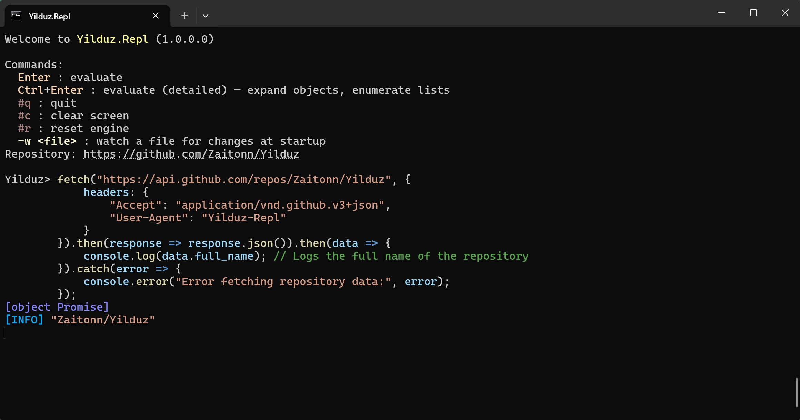

# Yilduz

[](https://wakatime.com/badge/github/Zaitonn/Yilduz)
[](https://www.nuget.org/packages/Yilduz)

An extension library for [Jint](https://github.com/sebastienros/jint) that adds [Web API](https://developer.mozilla.org/en-US/docs/Web/API) implementations such as [`ReadableStream`](https://developer.mozilla.org/en-US/docs/Web/API/ReadableStream), [`localStorage`](https://developer.mozilla.org/en-US/docs/Web/API/Window/localStorage), [`fetch`](https://developer.mozilla.org/en-US/docs/Web/API/Window/fetch), [`setTimeout`](https://developer.mozilla.org/en-US/docs/Web/API/Window/setTimeout), etc.

## Usage

```sh
dotnet add package Yilduz
```

```cs
using Jint;
using Yilduz;

using var cts = new CancellationTokenSource();
using var engine = new Engine((o) => o.CancellationToken(cts.Token)).InitializeWebApi(
    new() { CancellationToken = cts.Token }
);

engine.Execute(
    """
    console.log('Hello world!');
    setTimeout(() => console.log('I can use `setTimeout`!'), 2000);
    """
);

cts.Cancel();
```

## Development Progress

<details>
<summary>Click to expand</summary>

- Aborting
  - [x] `AbortController`
  - [x] `AbortSignal`
- Base64
  - [x] `atob()`
  - [x] `btoa()`
- Compression
  - [x] `CompressionStream`
  - [x] `DecompressionStream`
- Console
  - [x] `console`
- Data
  - [x] `Blob`
  - [ ] `Document`
  - [x] `File`
  - [x] `FileReader`
  - [x] `FileReaderSync`
  - [x] `FormData`
- DOM
  - [ ] `DOMError`
  - [x] `DOMException`
- Encoding
  - [x] `TextDecoder`
  - [x] `TextDecoderStream`
  - [x] `TextEncoder`
  - [x] `TextEncoderStream`
- Events
  - [x] `CloseEvent`
  - [x] `Event`
  - [x] `EventTarget`
  - [x] `MessageEvent`
  - [x] `ProgressEvent`
- Network
  - [x] `fetch()`
  - [x] `Headers`
  - [x] `Request`
  - [x] `Response`
  - [x] `WebSocket`
  - [x] `XMLHttpRequest`
  - [x] `XMLHttpRequestEventTarget`
  - [x] `XMLHttpRequestUpload`
- Streams
  - [x] `ByteLengthQueuingStrategy`
  - [x] `CountQueuingStrategy`
  - [ ] `ReadableByteStreamController`
  - [x] `ReadableStream`
    - Async iteration is not implemented yet in Jint
  - [ ] `ReadableStreamBYOBReader`
  - [x] `ReadableStreamBYOBRequest`
  - [x] `ReadableStreamDefaultReader`
  - [x] `ReadableStreamDefaultController`
  - [x] `WritableStream`
  - [x] `WritableStreamDefaultWriter`
  - [x] `WritableStreamDefaultController`
  - [x] `TransformStream`
  - [x] `TransformStreamDefaultController`
- Storages
  - [x] `localStorage`
  - [x] `sessionStorage`
- Timers
  - [x] `setTimeout()`
  - [x] `setInterval()`
  - [x] `clearTimeout()`
  - [x] `clearInterval()`
- URLs
  - [x] `URL`
  - [x] `URLSearchParams`

</details>

## Try Yilduz.Repl

>Want to try these features right now?

Just use Yilduz.Repl, a JavaScript REPL (Read-Eval-Print-Loop) program with Web API support, syntax error hints and syntax highlighting. Grab the latest artifact from the [build workflow](https://github.com/Zaitonn/Yilduz/actions/workflows/build.yml).



## Known Issues

### Encoding Support

The `TextDecoder` implementation supports common character encodings including UTF-8, UTF-16, ASCII, and ISO-8859-1.

If you need to use additional character encodings beyond the common ones, you'll need to install the [`System.Text.Encoding.CodePages` NuGet package](https://www.nuget.org/packages/System.Text.Encoding.CodePages/) and register the encoding providers:

```cs
using System.Text;

var engine = new Engine().InitializeWebApi(new() { CancellationToken = token });
// engine.Evaluate("new TextDecoder('gb_2312').encoding"); // throws an error

// Register additional encoding providers
Encoding.RegisterProvider(CodePagesEncodingProvider.Instance);

engine.Evaluate("new TextDecoder('gb_2312').encoding"); // = 'gbk'
```

This enables support for legacy encodings such as Windows-1252, Shift-JIS, and other code page encodings.

### Compression Support

By default, Yilduz supports the following compression formats specified in [the WHATWG standard](https://compression.spec.whatwg.org/#supported-formats):

| Format        | Underlying .NET Implementation        | Note                 |
| ------------- | ------------------------------------- | -------------------- |
| `gzip`        | `System.IO.Compression.GZipStream`    |                      |
| `deflate-raw` | `System.IO.Compression.DeflateStream` |                      |
| `deflate`     | `System.IO.Compression.ZLibStream`    | Available in .NET 6+ |

Additionally, you can completely customize the underlying compression implementations or add new formats (such as Brotli) by overriding `Options.Compression.CompressorFactory` and `Options.Compression.DecompressorFactory` during initialization. You can turn to [CustomProviderTests.cs](src/Yilduz.Tests/Compression/CustomProviderTests.cs) for examples of how to do this.

### Spec Deviations

Some behaviors may differ slightly from Web specs because certain features wrap .NET types; we're working through these gaps.

- [`WebSocket.extensions`](https://developer.mozilla.org/en-US/docs/Web/API/WebSocket/extensions) is only available when using .NET 7.0 or later, since the [`ClientWebSocket.HttpResponseHeaders`](https://learn.microsoft.com/en-us/dotnet/api/system.net.websockets.clientwebsocket.httpresponseheaders) property requires .NET 7.0+. On earlier versions, this value will always be an empty string (`''`).

## Origin of the name

~~It was chosen arbitrarily.~~

The name comes from a little-known alternative name for [the North Star](https://en.wikipedia.org/wiki/Polaris).
